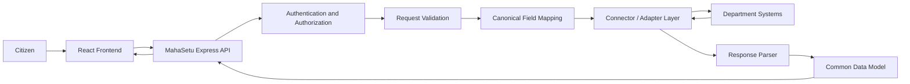

# MahaSetu

**Unified Interoperability Platform for Maharashtra Government Digital Services**

MahaSetu is a Smart India Hackathon MVP that gives citizens one interface for accessing services backed by different departmental systems. It sits between the citizen experience and existing government platforms, handling field mapping, response parsing, protocol differences, consent, and application orchestration behind the scenes.

The repository includes a citizen web application, a Node.js API, a reusable integration engine, mock departmental services for demonstrations, and an optional Python entity-resolution model.

## The Problem

Government departments may operate independent digital platforms with different APIs, protocols, data structures, and legacy conventions. This fragmentation can lead to:

- Inconsistent field names and data formats
- Repeated entry of the same citizen information
- Separate integrations that are difficult to maintain
- Different REST and SOAP/XML interfaces
- A fragmented application and status experience

## Our Solution

MahaSetu provides an interoperability layer with:

- A unified citizen interface and authenticated service experience
- A common citizen representation and configurable field mapping
- Adapter-based REST and SOAP/XML integration
- Request validation, response parsing, and record verification
- Consent-based access to citizen data for application prefill
- Application orchestration, document management, tracking, and notifications
- Audit records, role checks, and resource ownership enforcement

The MVP can run against its included mock departmental services. Real departmental systems require their API contracts and configuration before they can be connected.

## Citizen Journey

```text
Public Home
    ↓
Register / Login (email and password)
    ↓
Authenticated Home
    ↓
Employment → Browse Jobs → Job Details → Apply
    ↓
Application Form → Fetch My Data → Consent
    ↓
Profile Prefill → Complete Missing Information
    ↓
Upload Required Documents → Review → Submit
    ↓
Application ID → Track Application → My Profile
```

Registration and login use email and password. Successful authentication issues a JWT for protected API requests.

## Technical Architecture



The backend contains application, consent, verification, audit, notification, profile, document, and Employment modules. The standalone `integration-engine` package separates connector and mapping concerns from citizen-facing application logic.

## Common Data Model & Mapping

Departments often represent the same information differently:

| Department A | Department B | MahaSetu concept |
| --- | --- | --- |
| `candidate_name` | `fullName` | `name` |
| `date_of_birth` | `dob` | `dateOfBirth` |
| `mobile_no` | `phone` | `phone` |

The mapping layer reads configured source fields and writes them into the canonical citizen structure, including nested education and employment data. This keeps department-specific naming outside the rest of the application.

## Integration & Connector Layer

The integration engine selects a connector from department configuration:

- The REST connector calls configured operations with Axios.
- The SOAP connector sends XML and parses XML responses.
- Response parsers and field mappings normalize returned data.
- Connector interfaces allow more protocols to be added when a department contract requires them.

GraphQL is not implemented in the current engine.

## Request Flow

1. A citizen initiates a request in the frontend.
2. The backend authenticates the JWT and checks the role and resource owner.
3. Route and domain validation reject invalid input.
4. The engine maps fields into the required representation.
5. Department configuration determines the connector.
6. The connector sends the external request.
7. The adapter receives the response.
8. The response parser handles JSON or XML as configured.
9. Field mapping produces a common representation.
10. MahaSetu returns the service or application result to the citizen.

Backend integration calls include configurable timeouts and retries, retry only eligible failures, and use a circuit breaker. API middleware assigns request IDs, sanitizes unhandled errors, applies rate limits, and records domain actions in the audit log.

## Employment Service

The implemented Employment MVP includes:

- Searchable and filterable seeded job listings
- Job details and job-specific field and document requirements
- A draft application and multi-step application wizard
- Consent-based **Fetch My Data** profile prefill
- Manual completion and review of missing information
- Cloudinary document upload and required-document validation
- Submission with a generated application/tracking ID
- Citizen-owned application lists, status, timeline, and notifications
- An external synchronization status on each application

The real external Employment Portal is currently `NOT_CONFIGURED`. **The MVP persists the application in MahaSetu and maintains an external synchronization status. The actual Employment Portal connector can be attached when the external API/contract is available.** It does not claim or simulate a successful live external submission.

## Consent & Citizen Data

MahaSetu requires explicit, purpose-bound consent before the Employment flow fetches citizen profile data. Consent belongs to an authenticated citizen and a specific application, carries allowed data categories, can expire, and can be revoked.

The backend fetches data only for the authenticated citizen. Returned fields prefill the application for review; the citizen can edit the form and complete fields that are unavailable in the profile. Consent creation, revocation, expiration, and data-access activity are auditable.

## Document Management

- Supported formats: PDF, JPEG, and PNG
- Maximum upload size: 10 MB per file
- Binary storage: Cloudinary, organized by application
- Metadata storage: MongoDB, including type, format, size, and application/user association
- Operations: authenticated upload, listing, and owner-controlled deletion
- Protection: application ownership checks, officer/admin read rules, and audit events

Cloudinary credentials stay on the backend and are never included in this repository or sent to the frontend.

## My Profile

The protected profile experience shows personal citizen information, available education/profile data, and citizen documents where applicable. Backend queries use the authenticated identity and enforce ownership so one citizen cannot retrieve another citizen's profile or private resources.

## Application Tracking

Citizens can view their own applications with the application ID, job and department information, current application status, external synchronization state, and timeline information. When no real Employment Portal connector is installed, the external state remains `NOT_CONFIGURED`.

## Security

The current implementation includes:

- bcrypt password hashing and password-safe API responses
- JWT authentication for protected endpoints
- Citizen, department-officer, and admin role checks
- Application, consent, profile, and document ownership enforcement
- Input and upload validation
- General and authentication rate limiting
- Configurable CORS and security response headers
- Request IDs and sanitized server errors
- Audit logging for sensitive domain actions
- Server-side Cloudinary credentials

OAuth and encryption-at-rest configuration are outside the current MVP.

## Entity Resolution / ML

The optional Python entity-resolution component estimates whether records from separate systems refer to the same citizen. It uses a scikit-learn Logistic Regression pipeline with `StandardScaler`, class balancing, and probability-based decisions.

Features cover name similarity, date-of-birth match and day difference, phone match, email match, address similarity, and unknown date-of-birth handling. RapidFuzz computes text similarities. The output includes field scores, confidence, and a `MATCH`, `REVIEW`, or `NOT_MATCH` decision.

When `ML_MATCHER=python` is selected, the Node backend sends JSON to `src/cli.py` over standard input and reads the JSON result from standard output. The default backend matcher remains available when Python matching is not selected.

## Technology Stack

| Area | Implemented technology |
| --- | --- |
| Frontend | React 18, TypeScript, Vite, Tailwind CSS, React Router, Axios |
| Backend | Node.js, Express 5, TypeScript, Mongoose |
| Database | MongoDB |
| Integration | REST, SOAP/XML, Axios, `fast-xml-parser`, `xml2js` |
| Storage | Cloudinary |
| Authentication | JWT, bcrypt |
| ML | Python, scikit-learn, pandas, NumPy, RapidFuzz, joblib |

## Repository Structure

```text
.
├── backend/
│   ├── src/engine/          # Backend adapters, mapping, parsing, reliability
│   ├── src/routes/          # API routes
│   ├── src/services/        # Domain and external-service adapters
│   └── src/scripts/         # Seeds, demos, and self-checks
├── frontend/
│   └── src/                 # React pages, components, API clients, and contexts
├── integration-engine/
│   ├── src/                 # Reusable connectors and canonical mapping
│   └── mock-government/     # Demo department servers
├── sih-entity-resolution-ml/
│   ├── src/                 # Feature generation, training, matching, and CLI
│   └── models/              # Trained model and metrics
├── package.json
└── README.md
```

## Prerequisites

- Node.js and npm
- MongoDB
- Python 3 with `venv` and `pip` if using the optional ML matcher
- A Cloudinary account for document upload demonstrations

## Environment Variables

Create `backend/.env` locally from `backend/.env.example`. Never commit this file.

| Purpose | Variables |
| --- | --- |
| Core backend | `PORT`, `MONGODB_URI`, `JWT_SECRET`, `NODE_ENV` |
| Document storage | `CLOUDINARY_CLOUD_NAME`, `CLOUDINARY_API_KEY`, `CLOUDINARY_API_SECRET` |
| Mock departments | `MOCK_EDU_PORT`, `MOCK_EMP_PORT` |
| Integration reliability | `ENGINE_HTTP_TIMEOUT_MS`, `ENGINE_HTTP_MAX_RETRIES`, `ENGINE_HTTP_BASE_RETRY_DELAY_MS` |
| Consent scheduler | `CONSENT_EXPIRY_CHECK_INTERVAL_MS` |
| Browser origins | `CORS_ORIGIN` or `ALLOWED_ORIGINS` |
| Rate limiting | `RATE_LIMIT_ENABLED`, `RATE_LIMIT_AUTH_MAX`, `RATE_LIMIT_AUTH_WINDOW_MS`, `RATE_LIMIT_GENERAL_MAX`, `RATE_LIMIT_GENERAL_WINDOW_MS`, `RATE_LIMIT_VERIFY_MAX`, `RATE_LIMIT_VERIFY_WINDOW_MS` |
| Optional Python matcher | `ML_MATCHER`, `ML_PYTHON`, `ML_PROJECT_PATH` |
| Local demo seed | `DEMO_CITIZEN_PASSWORD` |

Production startup validates MongoDB, JWT, and Cloudinary configuration. Values and credentials are intentionally omitted here.

## Installation

```bash
git clone https://github.com/CodeWith-sakib/SIH26.git
cd SIH26

# Install root workspaces: backend and integration-engine
npm install

# The frontend is currently a separate package
npm install --prefix frontend
```

Optional Python matcher:

```bash
cd sih-entity-resolution-ml
python3 -m venv .venv
.venv/bin/pip install -r requirements.txt
cd ..
```

## Running Locally

Start MongoDB, create `backend/.env`, and use separate terminals:

```bash
# Terminal 1: backend API
npm run dev

# Terminal 2: frontend
npm run dev --prefix frontend
```

The backend defaults to port `5003` for local development. Vite serves the frontend and proxies `/api` requests according to `frontend/vite.config.ts`.

To exercise the generic integration demonstration, start its included mock department servers and run the demo in separate terminals:

```bash
npm run demo:mock --workspace=backend
npm run demo --workspace=backend
```

To select the optional Python matcher after installing its dependencies:

```bash
ML_MATCHER=python ML_PYTHON="$(pwd)/sih-entity-resolution-ml/.venv/bin/python" \
  npm run demo:ml --workspace=backend
```

## Build

```bash
# integration-engine and backend
npm run build

# frontend
npm run build --prefix frontend
```

The backend also provides focused self-check scripts. `npm run self-check:all --workspace=backend` exercises matching, reliability, consent expiration, auditing, security, password/JWT authentication, and end-to-end API behavior against a suitable local test database.

## Demo

A recommended SIH walkthrough is:

1. Open MahaSetu and register or log in.
2. Open **Employment** and browse or search jobs.
3. Select a job and start an application.
4. Choose **Fetch My Data**, review the consent details, and approve.
5. Observe available profile data populate the form.
6. Complete missing fields and upload the job's required documents.
7. Review and submit the application.
8. Use the application ID to inspect its status and timeline.
9. Open **My Profile** to review available citizen information and documents.

This path demonstrates how a unified experience can coordinate identity, consent, mapping, documents, and application state while keeping department integration behind the platform boundary.

## Current MVP Status

### Implemented

- Public MahaSetu home and email/password citizen authentication
- Protected citizen navigation and profile
- Employment job discovery, job details, draft wizard, consent-based prefill, document upload, submission, and tracking
- Consent lifecycle, notifications, audit logs, ownership rules, and role-protected administration routes
- Canonical mapping, REST and SOAP/XML connectors, parsing, retries, circuit breaking, and request tracing
- Mock education/employment systems and automated self-check scripts
- Optional Python entity-resolution inference through the backend

### Integration-ready

- Real Employment Portal adapter when its API and contract are available
- Additional departmental configurations, mappings, and adapters
- Deployment infrastructure appropriate to the target government environment

### Future Work

- Connect and validate against approved live departmental APIs
- Expand service-specific workflows beyond the current Employment MVP
- Add operational monitoring and production deployment automation
- Evaluate the entity-resolution model with approved representative datasets

## Current Limitations

- The external Employment Portal connector is not configured; applications are persisted in MahaSetu with an external status of `NOT_CONFIGURED`.
- Employment job data is locally seeded for the MVP.
- Included education and employment department services are mock systems for integration demonstrations.
- Additional departmental connectors depend on access to their real API contracts and environments.

---

Built for Smart India Hackathon 2026.
